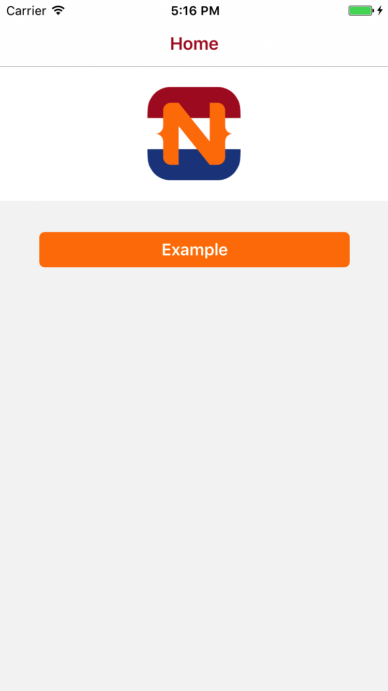

##Example of a multilingual NativeScript app

For more information please refer to the article "[How to create a multilingual NativeScript app?](https://nativescript.nl/tips/how-to-create-a-multilingual-nativescript-app/)" on the [NativeScript NL website](https://nativescript.nl).

####Instructions

```
git clone --depth 1 https://github.com/nativescriptnl/NSNL_Multilingual projectname
cd projectname
rm -rf .git
git init
npm install
tns platform add ios
tns livesync ios --watch
```


